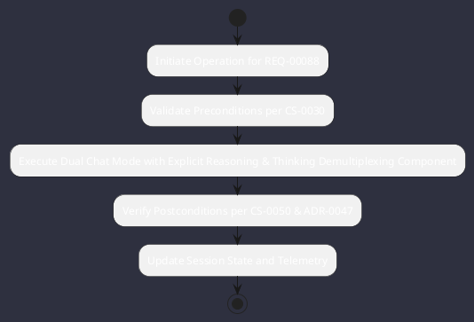

# REQ-00088: Dual Chat Mode with Explicit Reasoning & Thinking Demultiplexing

## Requirement Metadata

| Property | Value |
|---|---|
| **Requirement ID** | `REQ-00088` |
| **Title** | Dual Chat Mode with Explicit Reasoning & Thinking Demultiplexing |
| **Traceability** | [ADR-0047](../knowledge/knowledge_base.md) |
| **Priority** | Critical |
| **Verification Method** | Thinking Stream Extraction & Dual-Mode Prompt Integration Test |
| **Status** | Implemented |

## Description

The Agent Engine and AI Router shall support interactive chat execution in two explicit modes: standard chat and thinking/reasoning chat. In reasoning mode, model thinking blocks (<think>...</think> or native provider thinking streams) shall be demultiplexed in real time, streamed via dedicated channels, and displayed in real time inside collapsible/dimmed boxes above final responses in the Cyberpunk TUI, and expandable interactive reasoning cards in the Web UI.

## Rationale & Context

Enables transparent reasoning inspection and allows switching between fast token-efficient responses and deep reasoning steps across CLI, TUI, and Web.

## Architecture Specification & Activity Flow

## Acceptance & Verification Criteria

1. **Functional Compliance**: The implementation satisfies all criteria defined in [ADR-0047](../knowledge/knowledge_base.md).
2. **Quality Gate**: Code conforms strictly to `CS-0010` through `CS-0070` and `CS-0055` (Zero-Mock Rule) with zero Checkstyle/PMD warnings.
3. **Automated Testing**: Covered by automated unit/integration tests verified via `Thinking Stream Extraction & Dual-Mode Prompt Integration Test`.
4. **Documentation**: Fully indexed in the [Requirements Register](requirements_index.md).
