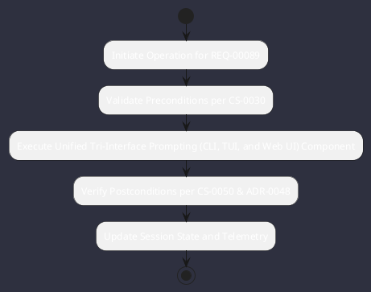

# REQ-00089: Unified Tri-Interface Prompting (CLI, TUI, and Web UI)

## Requirement Metadata

| Property | Value |
|---|---|
| **Requirement ID** | `REQ-00089` |
| **Title** | Unified Tri-Interface Prompting (CLI, TUI, and Web UI) |
| **Traceability** | [ADR-0048](../knowledge/knowledge_base.md) |
| **Priority** | Critical |
| **Verification Method** | Automated CLI Stdio, JLine TUI, and Playwright Java Web E2E & Lanterna VirtualScreen Test |
| **Status** | Specified |

## Description

The system shall provide prompt ingestion and response streaming seamlessly across all three primary user interface channels: direct non-interactive CLI arguments / stdin pipes, the interactive cyberpunk Lanterna/JLine TUI, and the Spring Boot Web HUD. Every prompt mode must support session context injection, tool execution confirmation, and cancellation.

## Rationale & Context

Guarantees parity and developer flexibility regardless of execution environment (CI scripts, developer terminal, or graphical browser).

## Architecture Specification & Activity Flow

## Acceptance & Verification Criteria

1. **Functional Compliance**: The implementation satisfies all criteria defined in [ADR-0048](../knowledge/knowledge_base.md).
2. **Quality Gate**: Code conforms strictly to `CS-0010` through `CS-0070` and `CS-0055` (Zero-Mock Rule) with zero Checkstyle/PMD warnings.
3. **Automated Testing**: Covered by automated unit/integration tests verified via `Automated CLI Stdio, JLine TUI, and Playwright Java Web E2E & Lanterna VirtualScreen Test`.
4. **Documentation**: Fully indexed in the [Requirements Register](requirements_index.md).
