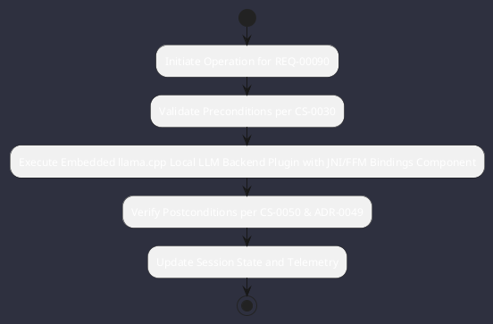

# REQ-00090: Embedded llama.cpp Local LLM Backend Plugin with JNI/FFM Bindings

## Requirement Metadata

| Property | Value |
|---|---|
| **Requirement ID** | `REQ-00090` |
| **Title** | Embedded llama.cpp Local LLM Backend Plugin with JNI/FFM Bindings |
| **Traceability** | [ADR-0049](../knowledge/knowledge_base.md) |
| **Priority** | Critical |
| **Verification Method** | llama.cpp In-Memory Inference & Token Generation Test |
| **Status** | Specified |

## Description

Omniwrench shall include a dedicated llama.cpp plugin (implementing BackendAdapter<T>) utilizing Java Foreign Function & Memory API (FFM / JEP 454) for high-performance direct native memory and pointer interop to execute GGUF-quantized models locally on CPU/GPU without requiring external services.

## Rationale & Context

Provides zero-dependency, private, air-gapped local AI inference capability directly within the Omniwrench runtime.

## Architecture Specification & Activity Flow

## Acceptance & Verification Criteria

1. **Functional Compliance**: The implementation satisfies all criteria defined in [ADR-0049](../knowledge/knowledge_base.md).
2. **Quality Gate**: Code conforms strictly to `CS-0010` through `CS-0070` and `CS-0055` (Zero-Mock Rule) with zero Checkstyle/PMD warnings.
3. **Automated Testing**: Covered by automated unit/integration tests verified via `llama.cpp In-Memory Inference & Token Generation Test`.
4. **Documentation**: Fully indexed in the [Requirements Register](requirements_index.md).
