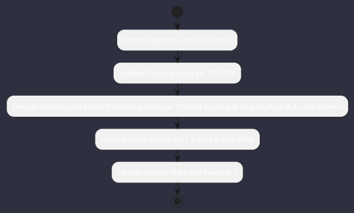

# REQ-00091: Multi-Source Model Repository Manager (Ollama Registry & HuggingFace Hub)

## Requirement Metadata

| Property | Value |
|---|---|
| **Requirement ID** | `REQ-00091` |
| **Title** | Multi-Source Model Repository Manager (Ollama Registry & HuggingFace Hub) |
| **Traceability** | [ADR-0050](../knowledge/knowledge_base.md) |
| **Priority** | High |
| **Verification Method** | Ollama / HuggingFace Model Search, Filter & Download Test |
| **Status** | Implemented |

## Description

The system shall provide an automated model downloader and catalog manager capable of searching, filtering, sorting, and downloading quantized GGUF models directly from the Ollama library/registry and HuggingFace model hub, with SHA-256 verification and resume support.

## Rationale & Context

Eliminates manual manual downloading of weights, enabling seamless one-click or CLI-driven model provisioning.

## Architecture Specification & Activity Flow

## Acceptance & Verification Criteria

1. **Functional Compliance**: The implementation satisfies all criteria defined in [ADR-0050](../knowledge/knowledge_base.md).
2. **Quality Gate**: Code conforms strictly to `CS-0010` through `CS-0070` and `CS-0055` (Zero-Mock Rule) with zero Checkstyle/PMD warnings.
3. **Automated Testing**: Covered by automated unit/integration tests verified via `Ollama / HuggingFace Model Search, Filter & Download Test`.
4. **Documentation**: Fully indexed in the [Requirements Register](requirements_index.md).
