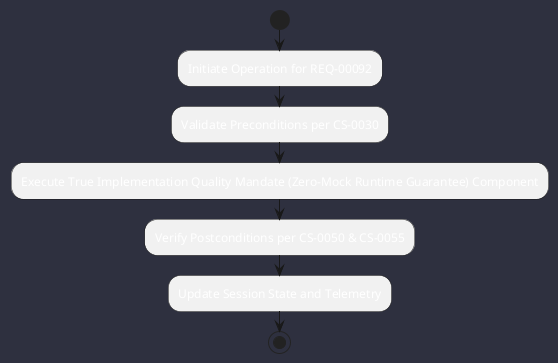

# REQ-00092: True Implementation Quality Mandate (Zero-Mock Runtime Guarantee)

## Requirement Metadata

| Property | Value |
|---|---|
| **Requirement ID** | `REQ-00092` |
| **Title** | True Implementation Quality Mandate (Zero-Mock Runtime Guarantee) |
| **Traceability** | [CS-0055](../knowledge/knowledge_base.md) |
| **Priority** | Critical |
| **Verification Method** | Bytecode & Runtime No-Mock Static Audit Rule |
| **Status** | Specified |

## Description

All production code, core engines, and plugins shall execute real, functional logic with actual I/O, subprocesses, native calls, and state manipulation. Hardwired stub data, simulated fake responses, or mock placeholders in production modules are strictly prohibited and enforced via automated static gates.

## Rationale & Context

Guarantees genuine end-to-end reliability and operational integrity in industrial infrastructure environments.

## Architecture Specification & Activity Flow

## Acceptance & Verification Criteria

1. **Functional Compliance**: The implementation satisfies all criteria defined in [CS-0055](../knowledge/knowledge_base.md).
2. **Quality Gate**: Code conforms strictly to `CS-0010` through `CS-0070` and `CS-0055` (Zero-Mock Rule) with zero Checkstyle/PMD warnings.
3. **Automated Testing**: Covered by automated unit/integration tests verified via `Bytecode & Runtime No-Mock Static Audit Rule`.
4. **Documentation**: Fully indexed in the [Requirements Register](requirements_index.md).
