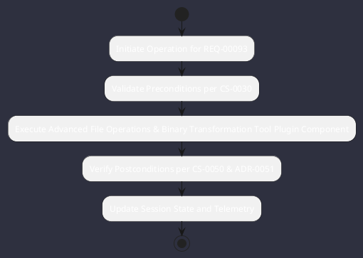

# REQ-00093: Advanced File Operations & Binary Transformation Tool Plugin

## Requirement Metadata

| Property | Value |
|---|---|
| **Requirement ID** | `REQ-00093` |
| **Title** | Advanced File Operations & Binary Transformation Tool Plugin |
| **Traceability** | [ADR-0051](../knowledge/knowledge_base.md) |
| **Priority** | Critical |
| **Verification Method** | File Tree, Binary/Hex Transform, Diff, Patch & Grep Test |
| **Status** | Specified |

## Description

The tool system shall provide an advanced file operations plugin covering recursive tree walking, find filtering, atomic read/write, unified diffing, structured hunk patch application (defaulting to the `*** Begin Patch ... *** End Patch` format with exact context seeking), full regex grep with line/column matches, binary inspection, hex-to-string, and string-to-hex encoding conversions.

## Rationale & Context

Equips the autonomous agent with full low-level file manipulation and inspection tools essential for complex refactoring.

## Architecture Specification & Activity Flow

## Acceptance & Verification Criteria

1. **Functional Compliance**: The implementation satisfies all criteria defined in [ADR-0051](../knowledge/knowledge_base.md).
2. **Quality Gate**: Code conforms strictly to `CS-0010` through `CS-0070` and `CS-0055` (Zero-Mock Rule) with zero Checkstyle/PMD warnings.
3. **Automated Testing**: Covered by automated unit/integration tests verified via `File Tree, Binary/Hex Transform, Diff, Patch & Grep Test`.
4. **Documentation**: Fully indexed in the [Requirements Register](requirements_index.md).
