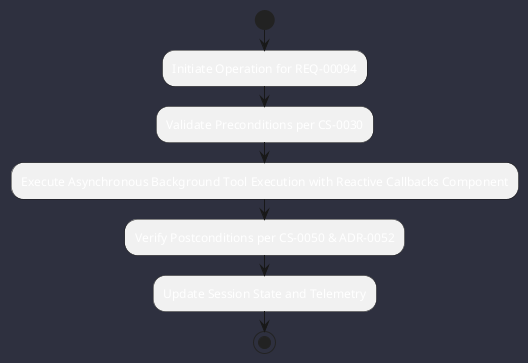

# REQ-00094: Asynchronous Background Tool Execution with Reactive Callbacks

## Requirement Metadata

| Property | Value |
|---|---|
| **Requirement ID** | `REQ-00094` |
| **Title** | Asynchronous Background Tool Execution with Reactive Callbacks |
| **Traceability** | [ADR-0052](../knowledge/knowledge_base.md) |
| **Priority** | High |
| **Verification Method** | Virtual Thread Async Tool Background Job & Callback Test |
| **Status** | Specified |

## Description

The Tool SPI and Agent Engine shall support both synchronous and non-blocking asynchronous tool executions. Long-running tools (compilations, tree walks, model downloads) shall execute as background jobs on Virtual Threads, streaming progress deltas and notifying the agent via completion callbacks.

## Rationale & Context

Prevents UI freezing and agent turn timeouts during long-running operational tasks.

## Architecture Specification & Activity Flow

## Acceptance & Verification Criteria

1. **Functional Compliance**: The implementation satisfies all criteria defined in [ADR-0052](../knowledge/knowledge_base.md).
2. **Quality Gate**: Code conforms strictly to `CS-0010` through `CS-0070` and `CS-0055` (Zero-Mock Rule) with zero Checkstyle/PMD warnings.
3. **Automated Testing**: Covered by automated unit/integration tests verified via `Virtual Thread Async Tool Background Job & Callback Test`.
4. **Documentation**: Fully indexed in the [Requirements Register](requirements_index.md).
