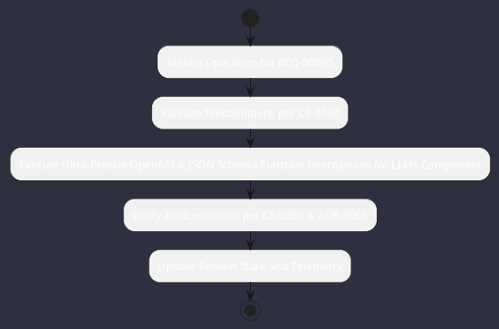

# REQ-00095: Ultra-Precise OpenAPI & JSON Schema Function Descriptions for LLMs

## Requirement Metadata

| Property | Value |
|---|---|
| **Requirement ID** | `REQ-00095` |
| **Title** | Ultra-Precise OpenAPI & JSON Schema Function Descriptions for LLMs |
| **Traceability** | [ADR-0053](../knowledge/knowledge_base.md) |
| **Priority** | Critical |
| **Verification Method** | OpenAPI 3.1 Function Schema Generator & LLM Tool Validation Test |
| **Status** | Specified |

## Description

The Tool Registry shall generate ultra-precise, unambiguous OpenAPI 3.1 / JSON Schema tool definitions including parameter constraints, enum values, edge-case documentation, and rich behavioral docstrings, while automatically filtering internal runtime injection context parameters.

## Rationale & Context

Maximizes tool calling accuracy and prevents hallucinated parameter generation across diverse language models.

## Architecture Specification & Activity Flow

## Acceptance & Verification Criteria

1. **Functional Compliance**: The implementation satisfies all criteria defined in [ADR-0053](../knowledge/knowledge_base.md).
2. **Quality Gate**: Code conforms strictly to `CS-0010` through `CS-0070` and `CS-0055` (Zero-Mock Rule) with zero Checkstyle/PMD warnings.
3. **Automated Testing**: Covered by automated unit/integration tests verified via `OpenAPI 3.1 Function Schema Generator & LLM Tool Validation Test`.
4. **Documentation**: Fully indexed in the [Requirements Register](requirements_index.md).
