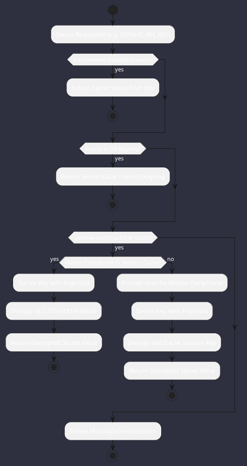

# REQ-00096: AES-256-GCM Encrypted Secret Vault and OS Keyring Engine

## Requirement Metadata

| Property | Value |
|---|---|
| **Requirement ID** | `REQ-00096` |
| **Title** | AES-256-GCM Encrypted Secret Vault and OS Keyring Engine |
| **Traceability** | [ADR-0054](../knowledge/knowledge_base.md) |
| **Priority** | Critical |
| **Verification Method** | Automated Vault Encryption, Keyring & Fallback Test |
| **Status** | Specified |

## Description

The core engine shall provide an authenticated encrypted secret vault (`.omniwrench/vault.enc`) using Argon2id key derivation and AES-256-GCM authenticated cipher, integrated with transparent fallback to OS native keyrings (`libsecret`/`Keychain`) and environment variables.

## Rationale & Context

Protects sensitive provider API keys (OpenAI, Anthropic, Gemini, DeepSeek, GitHub tokens) from plain-text disk exposure while preserving seamless developer ergonomics across environments.

## Architecture Specification & Activity Flow

## Acceptance & Verification Criteria

1. **Cryptographic Security**: Passwords derived via Argon2id; payloads encrypted with AES-256-GCM with authentication tag validation.
2. **Transparent Fallback**: Correct resolution order (Env -> OS Keyring -> Encrypted Vault).
3. **Quality Gate**: Zero mock implementations; conforms to `CS-0010` through `CS-0070` and `CS-0055`.
4. **Documentation**: Fully indexed in [Requirements Register](requirements_index.md).
