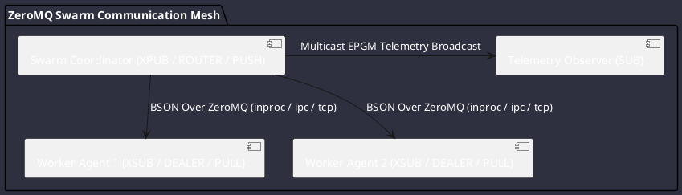

# REQ-00097: ZeroMQ Transport Mesh with BSON Binary Serialization for Swarm IPC

## Requirement Metadata

| Property | Value |
|---|---|
| **Requirement ID** | `REQ-00097` |
| **Title** | ZeroMQ Transport Mesh with BSON Binary Serialization for Swarm IPC |
| **Traceability** | [ADR-0055](../knowledge/knowledge_base.md) |
| **Priority** | Critical |
| **Verification Method** | Automated ZeroMQ Sockets (PUB/SUB, REQ/REP, PUSH/PULL) & BSON Serialization Test |
| **Status** | Specified |

## Description

The subagent swarm communication framework shall utilize ZeroMQ (`JeroMQ`) as the core transport layer and BSON (Binary JSON) as the serialization format. The ZeroMQ layer shall support diverse messaging patterns (PUB/SUB, XPUB/XSUB, REQ/REP, DEALER/ROUTER, PUSH/PULL) across `inproc`, `ipc`, `tcp`, and multicast (`epgm`/`pgm`/UDP) transports.

## Rationale & Context

Provides high-throughput, microsecond-latency, brokerless and proxied multi-agent communication for virtual thread swarms and multi-process distributed clusters without heavy external broker infrastructure.

## Architecture Specification & Activity Flow

## Acceptance & Verification Criteria

1. **Serialization Accuracy**: Messages serialized to BSON and deserialized retain full fidelity across all complex payload types.
2. **Topology Verification**: Unit tests verify functional correctness of PUB/SUB, REQ/REP, DEALER/ROUTER, and PUSH/PULL sockets.
3. **Transport Flexibility**: Sockets function seamlessly across `inproc://`, `ipc://`, and `tcp://` endpoints.
4. **Quality Gate**: Conforms to `CS-0010` through `CS-0070` and `CS-0055` (Zero-mock mandate).
5. **Documentation**: Fully indexed in [Requirements Register](requirements_index.md).
