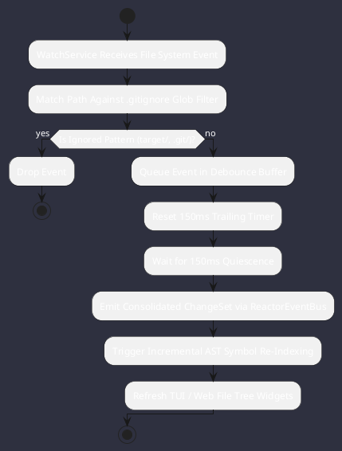

# REQ-00098: Asynchronous Java NIO WatchService and Debounced Workspace File Watcher

## Requirement Metadata

| Property | Value |
|---|---|
| **Requirement ID** | `REQ-00098` |
| **Title** | Asynchronous Java NIO WatchService and Debounced Workspace File Watcher |
| **Traceability** | [ADR-0056](../knowledge/knowledge_base.md) |
| **Priority** | High |
| **Verification Method** | Automated File Watcher Event Aggregation & Debounce Test |
| **Status** | Specified |

## Description

The core engine shall provide an asynchronous Java NIO `WatchService` running on a daemon Virtual Thread with 150ms trailing debounce aggregation and `.gitignore` exclusion filtering for live AST symbol updates and TUI file tree refresh.

## Rationale & Context

Ensures instantaneous response to workspace source edits while preventing high CPU utilization and event flooding during rapid automated refactoring or multi-file disk writes.

## Architecture Specification & Activity Flow

## Acceptance & Verification Criteria

1. **Debounce Correctness**: Multiple file modifications within 150ms consolidate into a single atomic change notification.
2. **Exclusion Enforcement**: Modifications in ignored directories (`target/`, `.git/`) produce zero downstream events.
3. **Quality Gate**: Conforms to `CS-0010` through `CS-0070` and `CS-0055` (Zero-mock production mandate).
4. **Documentation**: Fully indexed in [Requirements Register](requirements_index.md).
