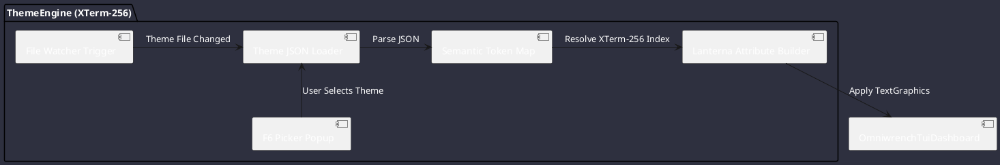

# REQ-00099: XTerm-256 Color Palette TUI Visual Theming Engine

## Requirement Metadata

| Property | Value |
|---|---|
| **Requirement ID** | `REQ-00099` |
| **Title** | XTerm-256 Color Palette TUI Visual Theming Engine |
| **Traceability** | [ADR-0057](../knowledge/knowledge_base.md) |
| **Priority** | Medium |
| **Verification Method** | Theme Hot-Reload, F6 Picker Popup & XTerm-256 Token Validation Test |
| **Status** | Specified |

## Description

The TUI visual theming engine shall target xterm-256 color mode exclusively, providing four bundled JSON themes with semantic color token mapping, live `F6` theme-picker popup with palette preview swatches, and hot-reload via the workspace file watcher.

## Rationale & Context

Ensures full compatibility across SSH servers, PuTTY, iTerm2, tmux, GNOME Terminal, and WSL environments where 24-bit true-color support is absent or disabled.

## Architecture Specification

## Acceptance & Verification Criteria

1. **Compatibility**: All UI elements render correctly in xterm-256 mode across iTerm2, tmux, PuTTY, and GNOME Terminal.
2. **Hot-Reload**: Theme change via JSON file edit triggers live refresh within one file-watcher debounce cycle (≤250ms).
3. **F6 Picker**: `F6` opens floating picker with all bundled themes and preview swatches visible.
4. **Quality Gate**: Conforms to `CS-0010` through `CS-0070` and `CS-0055`.
5. **Documentation**: Fully indexed in [Requirements Register](requirements_index.md).
