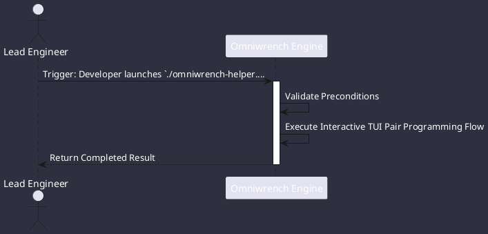

# UC-00001: Interactive TUI Pair Programming

## Scenario Overview

| Property | Value |
|---|---|
| **Use Case ID** | `UC-00001` |
| **Title** | Interactive TUI Pair Programming |
| **Primary Actor** | Lead Engineer |
| **Trigger** | Developer launches `./omniwrench-helper.sh tui` from a terminal workspace. |

## Preconditions & Postconditions

- **Preconditions**: Omniwrench binary or source available; active terminal with ANSI/TrueColor support.
- **Postconditions**: User prompt answered; code suggestions presented in chat panel; session state updated.

## Execution Workflow Diagram

## Detailed Action Steps

1. **Step 1**: TUI renders the multi-pane Cyberpunk dashboard, detecting terminal size and color depth.
2. **Step 2**: Developer types a prompt (e.g. 'Inspect our SessionManager error handling').
3. **Step 3**: Smart Router selects the optimal model tier (STANDARD).
4. **Step 4**: Agent queries workspace symbols using hybrid BM25/Vector RAG, reads relevant files, and displays streaming explanations in the chat panel with glowing neon badges.
5. **Step 5**: Developer reviews suggestions in real-time.

## Related Links
- [Use Cases Register](use_cases_index.md)
- [Requirements Register](../requirements/requirements_index.md)
- [Architecture Components](../architecture/components.md)
