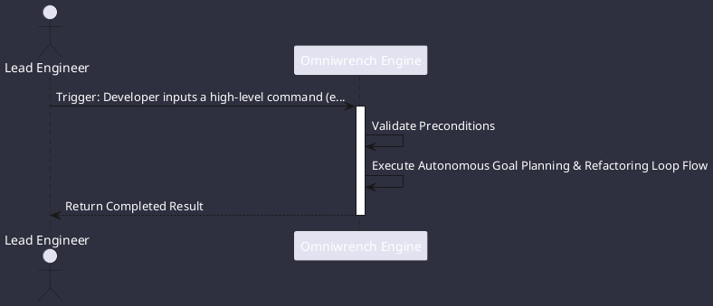

# UC-00002: Autonomous Goal Planning & Refactoring Loop

## Scenario Overview

| Property | Value |
|---|---|
| **Use Case ID** | `UC-00002` |
| **Title** | Autonomous Goal Planning & Refactoring Loop |
| **Primary Actor** | Lead Engineer |
| **Trigger** | Developer inputs a high-level command (e.g. `/plan Refactor exception hierarchy across all modules`). |

## Preconditions & Postconditions

- **Preconditions**: Clean or committed workspace repository; active session context.
- **Postconditions**: Multi-step DAG executed; checkpoint recorded; modified files compiled and verified.

## Execution Workflow Diagram

## Detailed Action Steps

1. **Step 1**: Agent engine activates the Hybrid Reasoning Loop (ADR-0008), constructing a multi-step Plan-and-Execute DAG.
2. **Step 2**: Each subtask is assigned a TSK-* identifier and written atomically to .omniwrench/tasks/{taskId}.json.
3. **Step 3**: For destructive steps, the Command Safety Classifier evaluates the action level per CS-0070, prompting the developer for interactive clearance before proceeding.
4. **Step 4**: On completion of each step, the task checkpoint updates automatically.

## Related Links
- [Use Cases Register](use_cases_index.md)
- [Requirements Register](../requirements/requirements_index.md)
- [Architecture Components](../architecture/components.md)
