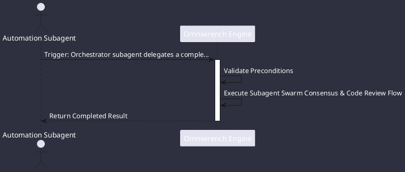

# UC-00003: Subagent Swarm Consensus & Code Review

## Scenario Overview

| Property | Value |
|---|---|
| **Use Case ID** | `UC-00003` |
| **Title** | Subagent Swarm Consensus & Code Review |
| **Primary Actor** | Automation Subagent |
| **Trigger** | Orchestrator subagent delegates a complex architectural trade-off to a dynamic swarm (ADR-0017, ADR-0035). |

## Preconditions & Postconditions

- **Preconditions**: Multi-agent swarm coordination enabled; at least two worker actors spawned.
- **Postconditions**: Quorum voting achieved (>=66%); consensus result synthesized into parent session.

## Execution Workflow Diagram

## Detailed Action Steps

1. **Step 1**: Virtual thread actors (SwarmWorker) receive typed SwarmEnvelope messages over private channels.
2. **Step 2**: Proposer subagent submits a refactoring proposal; Critic subagent analyzes potential regression risks.
3. **Step 3**: Coordinator opens a ConsensusRound collecting structured votes.
4. **Step 4**: Once quorum (>=66%) is achieved, the agreed resolution is published to the parent session.

## Related Links
- [Use Cases Register](use_cases_index.md)
- [Requirements Register](../requirements/requirements_index.md)
- [Architecture Components](../architecture/components.md)
