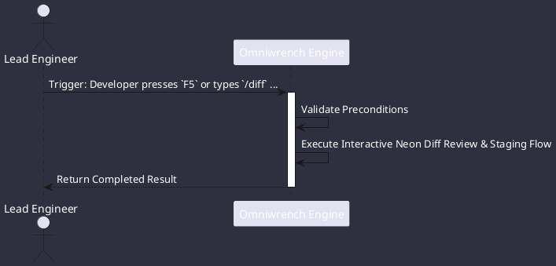

# UC-00004: Interactive Neon Diff Review & Staging

## Scenario Overview

| Property | Value |
|---|---|
| **Use Case ID** | `UC-00004` |
| **Title** | Interactive Neon Diff Review & Staging |
| **Primary Actor** | Lead Engineer |
| **Trigger** | Developer presses `F5` or types `/diff` after agent code generation. |

## Preconditions & Postconditions

- **Preconditions**: Unstaged git modifications in workspace.
- **Postconditions**: Selected hunks staged (`git add -p`); unapproved modifications reverted or left for review.

## Execution Workflow Diagram

## Detailed Action Steps

1. **Step 1**: The Neon Diff Viewer renders side-by-side colorized diffs.
2. **Step 2**: Developer uses `s` (stage hunk), `r` (revert hunk), or `Space` (toggle) to selectively approve modifications.
3. **Step 3**: Staged hunks are committed to git with standard conventional commit messages and `[WIP]` status.

## Related Links
- [Use Cases Register](use_cases_index.md)
- [Requirements Register](../requirements/requirements_index.md)
- [Architecture Components](../architecture/components.md)
