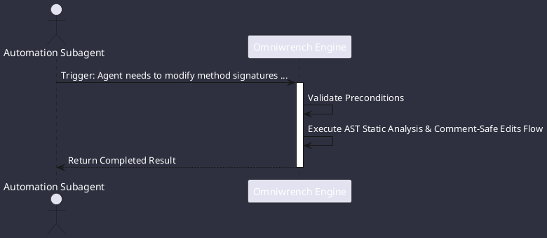

# UC-00005: AST Static Analysis & Comment-Safe Edits

## Scenario Overview

| Property | Value |
|---|---|
| **Use Case ID** | `UC-00005` |
| **Title** | AST Static Analysis & Comment-Safe Edits |
| **Primary Actor** | Automation Subagent |
| **Trigger** | Agent needs to modify method signatures without altering code formatting or stripping comments (ADR-0024). |

## Preconditions & Postconditions

- **Preconditions**: Valid Java source files; JavaParser 3.25+ classpath present.
- **Postconditions**: AST modified in-memory; source code written back with 100% comment and formatting fidelity.

## Execution Workflow Diagram

## Detailed Action Steps

1. **Step 1**: AstAnalysisTool parses Java source code using JavaParser with LexicalPreservingPrinter.
2. **Step 2**: AST visitor identifies exact AST nodes (methods, annotations, imports).
3. **Step 3**: Modifications are applied directly to the AST model and written back with 100% comment and formatting preservation.

## Related Links
- [Use Cases Register](use_cases_index.md)
- [Requirements Register](../requirements/requirements_index.md)
- [Architecture Components](../architecture/components.md)
