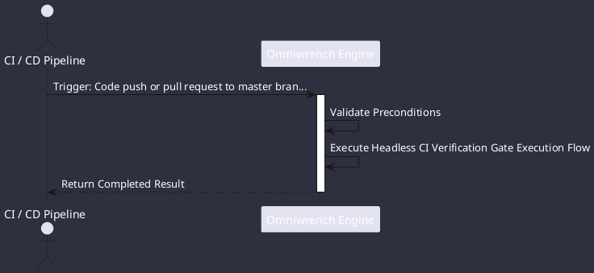

# UC-00006: Headless CI Verification Gate Execution

## Scenario Overview

| Property | Value |
|---|---|
| **Use Case ID** | `UC-00006` |
| **Title** | Headless CI Verification Gate Execution |
| **Primary Actor** | CI / CD Pipeline |
| **Trigger** | Code push or pull request to master branch (ADR-0032). |

## Preconditions & Postconditions

- **Preconditions**: GitHub Actions or Gitea Actions runner initialized with OpenJDK 21.
- **Postconditions**: Compile, Checkstyle, PMD, Surefire tests, and mkdocs-kit build pass cleanly.

## Execution Workflow Diagram

## Detailed Action Steps

1. **Step 1**: CI runner launches `mvn clean test` across the 6-module reactor.
2. **Step 2**: Checkstyle and PMD static rules enforce zero-tolerance standards (CS-0010 to CS-0070).
3. **Step 3**: Surefire runs 100% of unit and integration tests.
4. **Step 4**: Documentation site and PDF manuals are compiled and validated with `./helpers/build-docs.sh build`.

## Related Links
- [Use Cases Register](use_cases_index.md)
- [Requirements Register](../requirements/requirements_index.md)
- [Architecture Components](../architecture/components.md)
