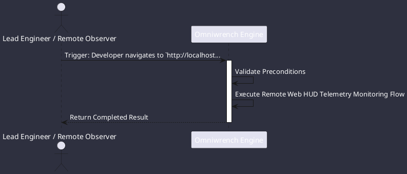

# UC-00007: Remote Web HUD Telemetry Monitoring

## Scenario Overview

| Property | Value |
|---|---|
| **Use Case ID** | `UC-00007` |
| **Title** | Remote Web HUD Telemetry Monitoring |
| **Primary Actor** | Lead Engineer / Remote Observer |
| **Trigger** | Developer navigates to `http://localhost:8080` in a web browser. |

## Preconditions & Postconditions

- **Preconditions**: Spring profile active with web enabled (`--spring.profiles.active=web|dual`).
- **Postconditions**: Real-time reasoning steps, tool diffs, and swarm activity displayed in browser.

## Execution Workflow Diagram

## Detailed Action Steps

1. **Step 1**: Embedded SPA connects to WebSocket endpoint `/ws/telemetry` using `X-Api-Key` authentication.
2. **Step 2**: Live telemetry streams agent reasoning steps, active subagent swarms, token throughput, and task DAG progression in real-time.

## Related Links
- [Use Cases Register](use_cases_index.md)
- [Requirements Register](../requirements/requirements_index.md)
- [Architecture Components](../architecture/components.md)
