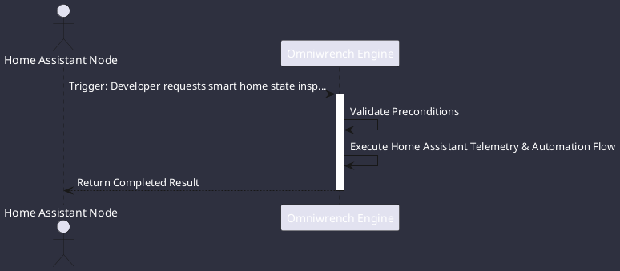

# UC-00008: Home Assistant Telemetry & Automation

## Scenario Overview

| Property | Value |
|---|---|
| **Use Case ID** | `UC-00008` |
| **Title** | Home Assistant Telemetry & Automation |
| **Primary Actor** | Home Assistant Node |
| **Trigger** | Developer requests smart home state inspection or automation triggering (ADR-0029). |

## Preconditions & Postconditions

- **Preconditions**: Home Assistant instance URL and Long-Lived Access Token configured.
- **Postconditions**: Entity state queried or service called; state change event broadcasted on EventBus.

## Execution Workflow Diagram

## Detailed Action Steps

1. **Step 1**: HomeAssistantTool connects to the local Home Assistant REST / WebSocket API via ProtocolBridge.
2. **Step 2**: Queries entity states (switches, sensors, lights) and dispatches authorized service calls.
3. **Step 3**: Real-time state change events flow into the Omniwrench reactive EventBus.

## Related Links
- [Use Cases Register](use_cases_index.md)
- [Requirements Register](../requirements/requirements_index.md)
- [Architecture Components](../architecture/components.md)
