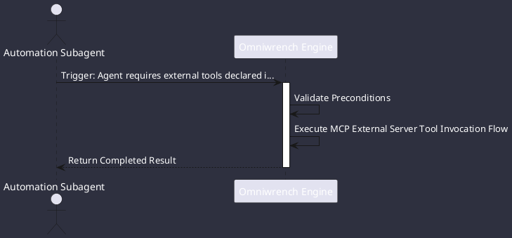

# UC-00009: MCP External Server Tool Invocation

## Scenario Overview

| Property | Value |
|---|---|
| **Use Case ID** | `UC-00009` |
| **Title** | MCP External Server Tool Invocation |
| **Primary Actor** | Automation Subagent |
| **Trigger** | Agent requires external tools declared in `.omniwrench/mcp-servers.json` (ADR-0036). |

## Preconditions & Postconditions

- **Preconditions**: Target MCP server configured and reachable over Stdio or SSE.
- **Postconditions**: External tool executed safely; structured result returned to reasoning loop.

## Execution Workflow Diagram

## Detailed Action Steps

1. **Step 1**: McpClientManager establishes Stdio / SSE connection to the target MCP server (e.g. GitHub or Postgres MCP).
2. **Step 2**: Tools are dynamically registered into ToolRegistry.
3. **Step 3**: Agent invokes external tools seamlessly through the standard ToolInvocation contract.

## Related Links
- [Use Cases Register](use_cases_index.md)
- [Requirements Register](../requirements/requirements_index.md)
- [Architecture Components](../architecture/components.md)
