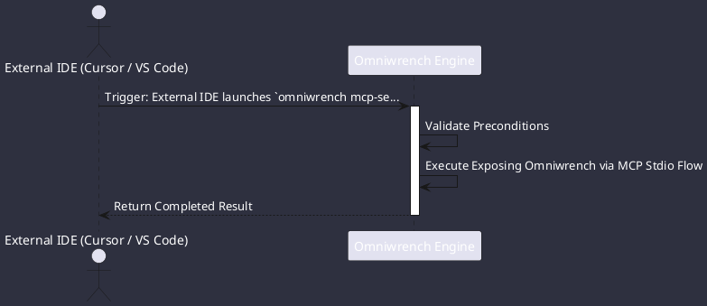

# UC-00010: Exposing Omniwrench via MCP Stdio

## Scenario Overview

| Property | Value |
|---|---|
| **Use Case ID** | `UC-00010` |
| **Title** | Exposing Omniwrench via MCP Stdio |
| **Primary Actor** | External IDE (Cursor / VS Code) |
| **Trigger** | External IDE launches `omniwrench mcp-server --stdio`. |

## Preconditions & Postconditions

- **Preconditions**: Omniwrench binary installed in system PATH.
- **Postconditions**: Omniwrench tools and session context available as MCP tools in external IDE.

## Execution Workflow Diagram

## Detailed Action Steps

1. **Step 1**: McpServerHost initializes JSON-RPC framing over standard I/O.
2. **Step 2**: Advertises Omniwrench's AST tools, file operations, Home Assistant bridge, and session resources.
3. **Step 3**: Handles tool invocation requests and returns structured results.

## Related Links
- [Use Cases Register](use_cases_index.md)
- [Requirements Register](../requirements/requirements_index.md)
- [Architecture Components](../architecture/components.md)
