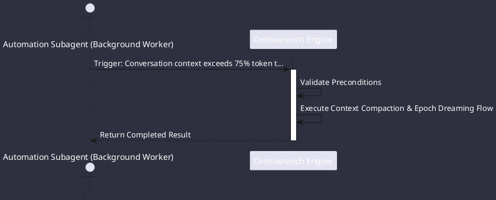

# UC-00011: Context Compaction & Epoch Dreaming

## Scenario Overview

| Property | Value |
|---|---|
| **Use Case ID** | `UC-00011` |
| **Title** | Context Compaction & Epoch Dreaming |
| **Primary Actor** | Automation Subagent (Background Worker) |
| **Trigger** | Conversation context exceeds 75% token threshold (ADR-0033). |

## Preconditions & Postconditions

- **Preconditions**: Active conversation session with high token volume (>64k tokens).
- **Postconditions**: Old turns archived and compressed; distilled summary block prepended to new epoch.

## Execution Workflow Diagram

## Detailed Action Steps

1. **Step 1**: Background worker distills conversational history into structured summary blocks (decisions, files, open questions).
2. **Step 2**: Generational epoch rotates, archiving raw turns into compressed files in .omniwrench/sessions/{id}/archive/.
3. **Step 3**: Active window continues with the distilled summary as preamble, preventing context overflow and reducing latency.

## Related Links
- [Use Cases Register](use_cases_index.md)
- [Requirements Register](../requirements/requirements_index.md)
- [Architecture Components](../architecture/components.md)
