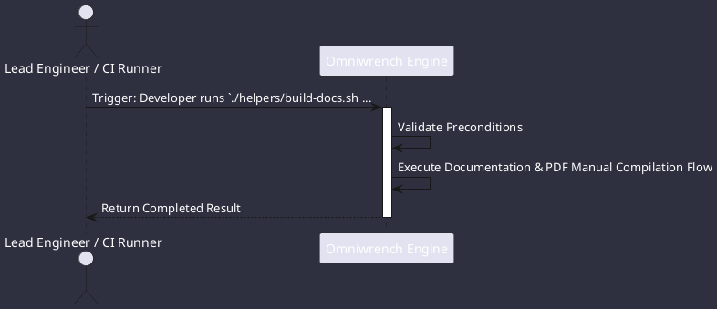

# UC-00012: Documentation & PDF Manual Compilation

## Scenario Overview

| Property | Value |
|---|---|
| **Use Case ID** | `UC-00012` |
| **Title** | Documentation & PDF Manual Compilation |
| **Primary Actor** | Lead Engineer / CI Runner |
| **Trigger** | Developer runs `./helpers/build-docs.sh build` (ADR-0003). |

## Preconditions & Postconditions

- **Preconditions**: mkdocs-kit, PlantUML, and WeasyPrint available in build environment.
- **Postconditions**: Static HTML5 documentation in `doc/site/` and complete PDF manual generated.

## Execution Workflow Diagram

## Detailed Action Steps

1. **Step 1**: mkdocs-kit scans all markdown files and parses PlantUML blocks into vector diagrams.
2. **Step 2**: Compiles standalone searchable HTML5 documentation in doc/site/.
3. **Step 3**: WeasyPrint compiles complete offline PDF manual doc/site/omniwrench-manual.pdf.

## Related Links
- [Use Cases Register](use_cases_index.md)
- [Requirements Register](../requirements/requirements_index.md)
- [Architecture Components](../architecture/components.md)
