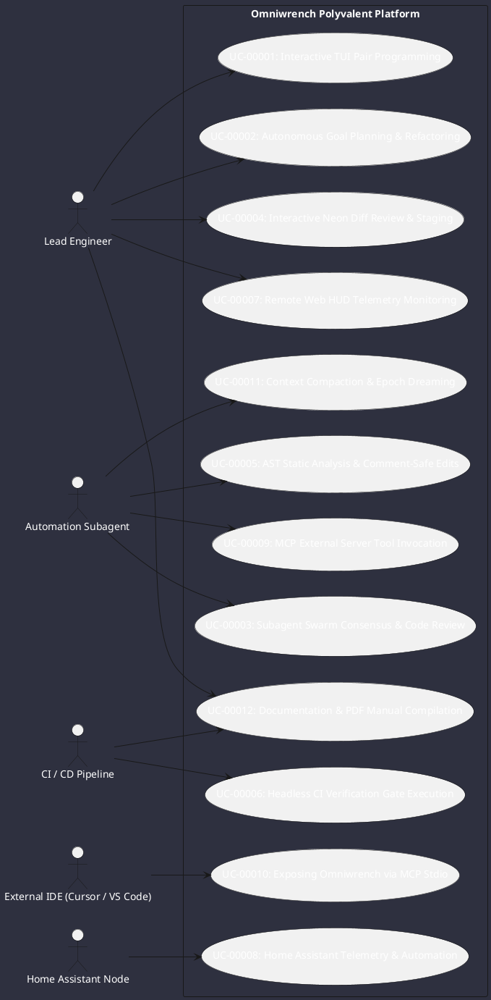

# Use Cases Register & Scenario Specifications

This catalog details developer, automation, and system interaction scenarios with Omniwrench.

## Detailed Use Case Scenarios

### `UC-00001`: Interactive TUI Pair Programming
- **Primary Actor**: Lead Engineer
- **Trigger**: Developer launches `./omniwrench-helper.sh tui` from a terminal workspace.
- **Workflow**:
  1. TUI renders the multi-pane Cyberpunk dashboard, detecting terminal size and color depth.
  2. Developer types a prompt (e.g. *"Inspect our SessionManager error handling"*).
  3. Smart Router selects the optimal model tier (`STANDARD`).
  4. Agent queries workspace symbols using hybrid BM25/Vector RAG, reads relevant files, and displays streaming explanations in the chat panel with glowing neon badges.
  5. Developer reviews suggestions in real-time.

### `UC-00002`: Autonomous Goal Planning & Refactoring
- **Primary Actor**: Lead Engineer
- **Trigger**: Developer inputs a high-level command (e.g. `/plan Refactor exception hierarchy across all modules`).
- **Workflow**:
  1. Agent engine activates the Hybrid Reasoning Loop (`ADR-0008`), constructing a multi-step Plan-and-Execute DAG.
  2. Each subtask is assigned a `TSK-*` identifier and written atomically to `.omniwrench/tasks/{taskId}.json`.
  3. For destructive steps, the Command Safety Classifier evaluates the action level per `CS-0070`, prompting the developer for interactive clearance before proceeding.
  4. On completion of each step, the task checkpoint updates automatically.

### `UC-00003`: Subagent Swarm Consensus & Code Review
- **Primary Actor**: Automation Subagent
- **Trigger**: Orchestrator subagent delegates a complex architectural trade-off to a dynamic swarm (`ADR-0017`, `ADR-0035`).
- **Workflow**:
  1. Virtual thread actors (`SwarmWorker`) receive typed `SwarmEnvelope` messages over private channels.
  2. Proposer subagent submits a refactoring proposal; Critic subagent analyzes potential regression risks.
  3. Coordinator opens a `ConsensusRound` collecting structured votes.
  4. Once quorum ($\ge 66\%$) is achieved, the agreed resolution is published to the parent session.

### `UC-00004`: Interactive Neon Diff Review & Staging
- **Primary Actor**: Lead Engineer
- **Trigger**: Developer presses `F5` or types `/diff` after agent code generation.
- **Workflow**:
  1. The Neon Diff Viewer renders side-by-side colorized diffs.
  2. Developer uses `s` (stage hunk), `r` (revert hunk), or `Space` (toggle) to selectively approve modifications.
  3. Staged hunks are committed to git with standard conventional commit messages and `[WIP]` status.

### `UC-00005`: AST Static Analysis & Comment-Safe Edits
- **Primary Actor**: Automation Subagent
- **Trigger**: Agent needs to modify method signatures without altering code formatting or stripping comments (`ADR-0024`).
- **Workflow**:
  1. `AstAnalysisTool` parses Java source code using JavaParser with `LexicalPreservingPrinter`.
  2. AST visitor identifies exact AST nodes (methods, annotations, imports).
  3. Modifications are applied directly to the AST model and written back with 100% comment and formatting preservation.

### `UC-00006`: Headless CI Verification Gate Execution
- **Primary Actor**: CI / CD Pipeline (GitHub Actions / Gitea Actions)
- **Trigger**: Code push or pull request to `master` branch (`ADR-0032`).
- **Workflow**:
  1. CI runner launches `mvn clean test` across the 6-module reactor.
  2. Checkstyle and PMD static rules enforce zero-tolerance standards (`CS-0010` to `CS-0070`).
  3. Surefire runs 100% of unit and integration tests.
  4. Documentation site and PDF manuals are compiled and validated with `./helpers/build-docs.sh build`.

### `UC-00007`: Remote Web HUD Telemetry Monitoring
- **Primary Actor**: Lead Engineer / Remote Observer
- **Trigger**: Developer navigates to `http://localhost:8080` in a web browser.
- **Workflow**:
  1. Embedded SPA connects to WebSocket endpoint `/ws/telemetry` using `X-Api-Key` authentication.
  2. Live telemetry streams agent reasoning steps, active subagent swarms, token throughput, and task DAG progression in real-time.

### `UC-00008`: Home Assistant Telemetry & Automation
- **Primary Actor**: Home Assistant Node
- **Trigger**: Developer requests smart home state inspection or automation triggering (`ADR-0029`).
- **Workflow**:
  1. `HomeAssistantTool` connects to the local Home Assistant REST / WebSocket API via `ProtocolBridge`.
  2. Queries entity states (switches, sensors, lights) and dispatches authorized service calls.
  3. Real-time state change events flow into the Omniwrench reactive `EventBus`.

### `UC-00009`: MCP External Server Tool Invocation
- **Primary Actor**: Automation Subagent
- **Trigger**: Agent requires external tools declared in `.omniwrench/mcp-servers.json` (`ADR-0036`).
- **Workflow**:
  1. `McpClientManager` establishes Stdio / SSE connection to the target MCP server (e.g. GitHub or Postgres MCP).
  2. Tools are dynamically registered into `ToolRegistry`.
  3. Agent invokes external tools seamlessly through the standard `ToolInvocation` contract.

### `UC-00010`: Exposing Omniwrench via MCP Stdio
- **Primary Actor**: External IDE (Cursor / VS Code / Claude Desktop)
- **Trigger**: External IDE launches `omniwrench mcp-server --stdio`.
- **Workflow**:
  1. `McpServerHost` initializes JSON-RPC framing over standard I/O.
  2. Advertises Omniwrench's AST tools, file operations, Home Assistant bridge, and session resources.
  3. Handles tool invocation requests and returns structured results.

### `UC-00011`: Context Compaction & Epoch Dreaming
- **Primary Actor**: Automation Subagent (Background Worker)
- **Trigger**: Conversation context exceeds 75% token threshold (`ADR-0033`).
- **Workflow**:
  1. Background worker distills conversational history into structured summary blocks (decisions, files, open questions).
  2. Generational epoch rotates, archiving raw turns into compressed files in `.omniwrench/sessions/{id}/archive/`.
  3. Active window continues with the distilled summary as preamble, preventing context overflow and reducing latency.

### `UC-00012`: Documentation & PDF Manual Compilation
- **Primary Actor**: Lead Engineer / CI Runner
- **Trigger**: Developer runs `./helpers/build-docs.sh build` (`ADR-0003`).
- **Workflow**:
  1. `mkdocs-kit` scans all markdown files and parses PlantUML blocks into vector diagrams.
  2. Compiles standalone searchable HTML5 documentation in `doc/site/`.
  3. WeasyPrint compiles complete offline PDF manual `doc/site/omniwrench-manual.pdf`.
