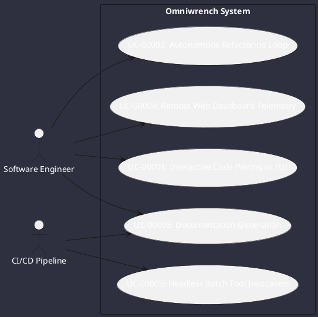

# Use Cases Register

Use case diagrams and scenarios for developer interactions with Omniwrench.

## Detailed Scenarios

### `UC-00001`: Interactive Code Pairing in TUI
The developer opens a terminal, launches `./omniwrench-helper.sh tui`, issues instructions to inspect or modify classes, observes realtime tool outputs, and reviews changes.

### `UC-00002`: Autonomous Refactoring Loop
The developer provides a high-level goal. The agent builds a plan with `TSK-*` tags, runs tests, fixes violations, validates Checkstyle/PMD gates, and requests clearance to commit.
