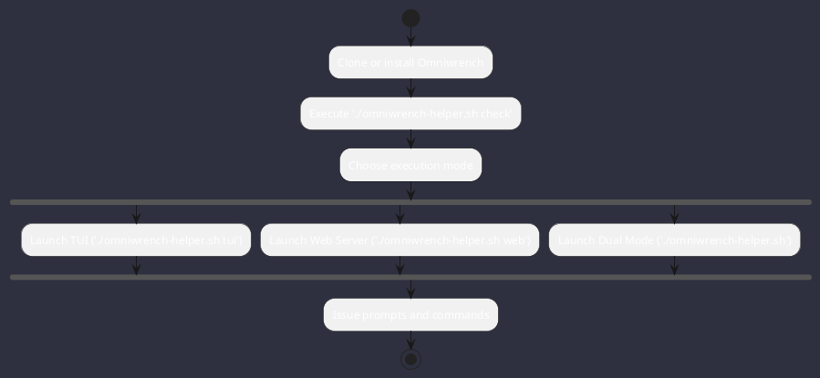

# Omniwrench User Manual: Overview & Quick Start

Omniwrench is an autonomous engineering assistant and developer workbench for mission-critical software engineering.



## System Requirements
- **Java / GraalVM**: GraalVM SDK / OpenJDK 17, 21, or 25 (tested with Oracle GraalVM / GraalVM Community Edition and Eclipse Temurin).
- **Native Image**: GraalVM Native Image for standalone AOT compilation (<20ms startup).
- **Maven**: Apache Maven 3.8+ (or bundled wrapper).
- **Python**: Python 3.10+ (for GraalVM installer helper and mkdocs documentation engine).
- **Operating System**: Linux (Debian, SUSE, RHEL, Arch, Ubuntu), macOS, or Windows (WSL2).
- **Terminal**: Modern ANSI/VT100 terminal supporting 256 colors or UTF-8 box characters.

## GraalVM SDK & Packaging Commands

```bash
# Automatically download, verify SHA-256, and configure the latest GraalVM SDK
./omniwrench-helper.sh setup-graalvm

# Activate environment in current terminal session
source ./activate-env.sh

# Build traditional JVM Spring Boot fat JAR
./omniwrench-helper.sh build-jvm

# Build standalone GraalVM Native Image binary
./omniwrench-helper.sh build-native
```

---

## ⚡ Quick Start: Running Omniwrench

### 1. Interactive Cyberpunk TUI
Launch the interactive dual terminal workbench:
```bash
./omniwrench-app/target/omniwrench tui
```

### 2. Single-Shot Non-Interactive Prompt
Execute direct prompts without entering interactive mode:
```bash
./omniwrench-app/target/omniwrench -p "hello"
```

### 3. Local Model Provisioning & Management
Search and pull local GGUF weights directly from Ollama or HuggingFace:
```bash
# Search for available models
./omniwrench-app/target/omniwrench -p "/model search gemma"

# Pull model weights from Ollama library
./omniwrench-app/target/omniwrench -p "/model pull gemma4:e2b"

# List locally cached models
./omniwrench-app/target/omniwrench -p "/model list"
```

