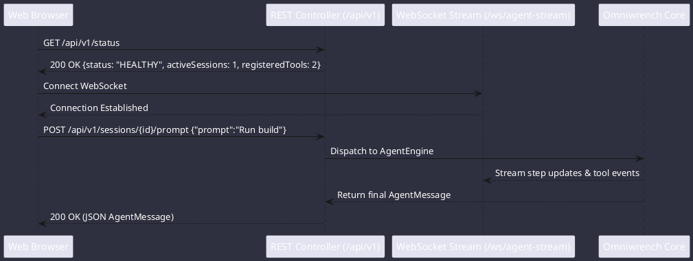

# Web & Telemetry Dashboard

Omniwrench embeds a high-throughput Spring Web & WebSocket server for remote monitoring, telemetry visualization, and browser-based agent pairing.

## REST Endpoints
- `GET /api/v1/status`: Health check, active sessions, registered tool count, JVM version.
- `GET /api/v1/tools`: List of registered tool definitions and schemas.
- `GET /api/v1/sessions/{id}/messages`: Full conversation transcript for a session.
- `POST /api/v1/sessions/{id}/prompt`: Submit a prompt to the agent reasoning engine.
