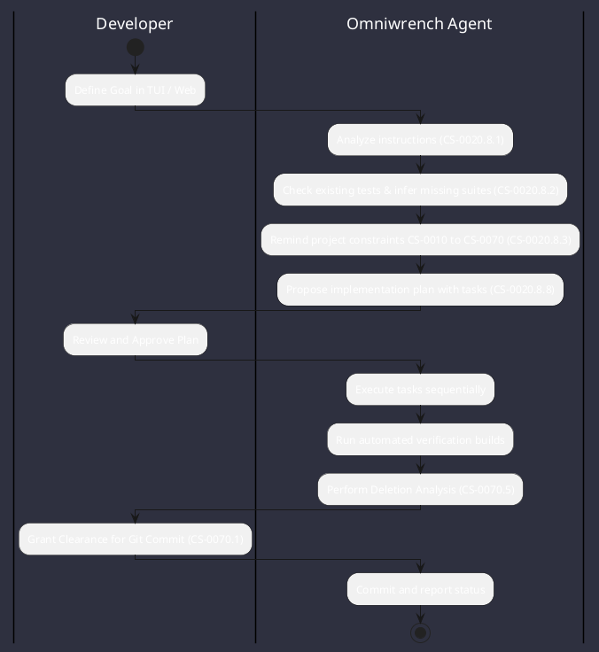

# Operational Workflows

Detailed step-by-step developer workflows for pairing with Omniwrench.

```plantuml
@startuml
skinparam backgroundColor #2e303f
skinparam defaultFontColor #ffffff

|Developer|
start
:Define Goal in TUI / Web;
|Omniwrench Agent|
:Analyze instructions (CS-0020.8.1);
:Check existing tests & infer missing suites (CS-0020.8.2);
:Remind project constraints CS-0010 to CS-0070 (CS-0020.8.3);
:Propose implementation plan with tasks (CS-0020.8.8);
|Developer|
:Review and Approve Plan;
|Omniwrench Agent|
:Execute tasks sequentially;
:Run automated verification builds;
:Perform Deletion Analysis (CS-0070.5);
|Developer|
:Grant Clearance for Git Commit (CS-0070.1);
|Omniwrench Agent|
:Commit and report status;
stop
@enduml
```
